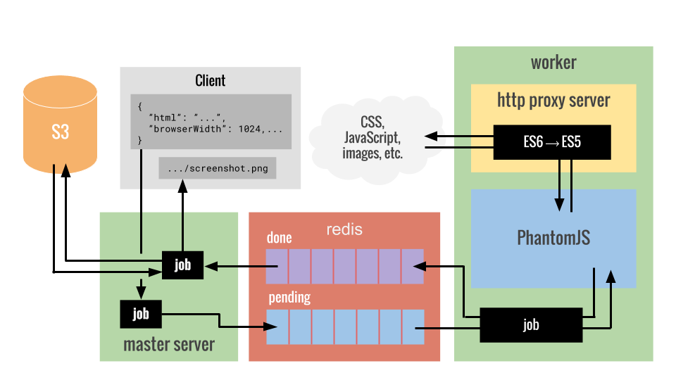

# Docshot

Micro-service for rendering html into images using a simple restful api

## Setup

dependencies:

* NodeJS
* npm
* PhanomJS
* redis

installation:

* in the project root run `npm install`

launching:

* the server: `npm run server`
* the worker: `npm run worker`
* both with the worker in the background: `npm start`

## Usage

the server only has one endpoint which expects POST requests in JSON
and generates a screenshot as the reply which will be sent back as a
url to the image in plain text.

Example:

```
POST /
```
```javascript
{
  html: '<html><head><titl...',
  browserWidth: 600,
  browserHeight: 800,
  url: 'https://github.com',
  scrollX: 0,
  scrollY: 0,
  clipX: 0,
  clipY: 0,
  clipWidth: 600,
  clipHeight: 800,
  userAgent: 'docshot'
}
```

response:

```
http://urltoimage.com/screenshot.png
```

|param        |type   |description|
|-------------|-------|-----------|
|html         |String |the html to render|
|browserWidth |Number |the width of the browser window|
|browserHeight|Number |the height of the browser window|
|url          |String |url used when requesting addional resources|
|scrollX      |Number |scroll distance from left|
|scrollY      |Number |scroll distance from top|
|clipX        |Number |left offset of crop|
|clipY        |Number |top offset of crop|
|clipWidth    |Number |width of crop area|
|clipHeight   |Number |height of crop area|
|userAgent    |String |user agent used when making addional requests|

## Architecture



Docshot uses PhantomJS to take screenshots which can be very time consuming.
To get around this, phantom is run outside of the main server and in a worker
which recieves jobs using a redis queue. Phantom also has limited support for
es6 which is fixed by cross compiling all javascript recieved down to es5 using
babel. The initial POST request will continue to stay open while screenshot is
pending completion. Although not idea, this makes notifying the client much more
straight forward.
